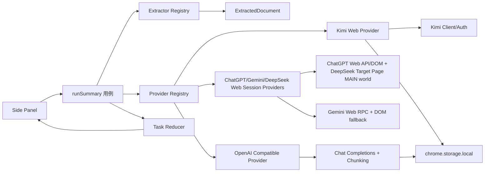

# 架构与数据流

## 组件边界



UI 只订阅任务状态。提取器不知道 Token、Prompt 或会话；Provider 不知道 DOM 和 React；应用编排只依赖 `SummaryProvider`。

## Provider 契约

```ts
interface SummaryProvider {
  id: "kimi-web" | "chatgpt-web" | "gemini-web" | "deepseek-web" | "openai-compatible";
  validateReady(): Promise<void>;
  summarize(request: SummaryRequest, signal: AbortSignal): AsyncIterable<SummaryEvent>;
}
```

`SummaryEvent` 只有四类：阶段、增量文本、warning 和完成。Kimi 完成事件带继续对话 URL；兼容端完成事件不带 URL。

网页会话 Provider 不保存站点凭据。用户点击登录按钮后，扩展按目标 origin 请求可选 host permission；总结时优先复用用户已经打开的同站点 Tab，没有可用 Tab 时才创建后台 Tab。ChatGPT 在该页面的 MAIN world 中先以页面 Cookie 读取短期 Web session，再调用 `/backend-api/conversation` 并只返回最终文本；接口失败后使用输入框、发送按钮和助手消息节点的 DOM 适配器。DeepSeek 直接使用页面 DOM；Gemini 优先参考 `gemini-nexus` 的 Web RPC，从 `gemini.google.com/app` 获取短期请求参数并调用 `StreamGenerate`，失败后再使用页面 DOM。ChatGPT access token 与 Gemini RPC 参数只存在于单次页面/请求内存中，不写入扩展存储。页面结构或内部协议变化会落到回退或 `auth-required`/`api-unavailable`，不会静默改用另一家后端。

## 任务生命周期

```text
idle
  -> loading(准备中)
  -> loading(extracting)
  -> loading(uploading/chunking/summarizing)
  -> success
  -> error / auth-required / provider-not-configured
```

每次重新总结都会先 abort 旧 `AbortController`，侧边栏卸载也会 abort。取消、后端切换和新任务不会自动切换到另一个 Provider。

## OpenAI Compatible 请求

请求地址固定为 `${apiRoot}/chat/completions`，请求头为 `Authorization: Bearer <token>`（loopback 空 Token 时省略），请求体固定包含 `model`、`stream` 和 system/user messages。

短内容一次请求。长内容先按标题、段落和换行边界分块；局部摘要顺序执行，再按相同上限分组递归归并，最终一轮流式输出。超过 `maxSourceChars` 时保留首尾并产生 warning；单分块上下文超限时递归减半，低于 2000 字符仍失败则终止任务。

## Kimi Web 请求

Kimi 适配层集中处理：refresh token、single-flight 刷新、一次 401 重放、预签名上传、文件注册、解析 SSE、创建 chat 和 completion SSE。文件上传/解析失败且存在 `sourceText` 时只在同一 Provider 内降级，不跨 Provider。

## 存储和权限

- 设置：`chrome.storage.local` 的 `settings:v2`。
- OpenAI Token：独立 key `secrets:openai-compatible:v1`，加载设置页时只显示“已配置”。
- Kimi Token：兼容旧 key `local:kimi_tokens`。
- ChatGPT/Gemini/DeepSeek 会话：不保存 Cookie、localStorage、access token 或页面正文；仅在内存中保留扩展创建或发现的页面 tab id。ChatGPT 的 access token 只在已打开页面的单次 Web API 函数内存中使用，Gemini 的 `at/bl/f.sid` 只用于单次 Web RPC，不写入存储。目标站点的登录态始终由 Chrome Profile 和网页自己管理。
- 设置页 Web 会话状态：只对已打开的对应站点 Tab 执行只读 DOM 检查；不创建标签页、不提交 Prompt、不调用站点 API。
- API Root 保存前校验协议并通过用户手势请求 `${origin}/*` 可选权限；修改 Root 后撤销旧 origin。
- content script 不接触 Token；兼容请求从 sidepanel extension page 发起。
- Bilibili 元数据与字幕请求由 background service worker 发起，固定声明 `api.bilibili.com` 和 `*.hdslb.com` host permissions，使用 `credentials: "include"` 获取站点会话能力；扩展不申请 `cookies` 权限、不读取或持久化 SESSDATA。已签名字幕资源使用 `credentials: "omit"`。
- YouTube 字幕优先从当前标签页 MAIN world 的播放器状态和 Performance timeline 读取；没有字幕轨时回退到页面同源 InnerTube player 请求。字幕请求先复用页面已经带 PO Token 的 timedtext URL，再按 BiliNote/youtube-transcript-api 的去 `fmt` 方式和 yt-dlp 的 JSON3、SRV、TTML、SRT、WebVTT 格式尝试；当前 Web 字幕轨返回空内容时，先读取 YouTube 自己的 transcript 面板，再从页面会话请求 Android VR、iOS、TV、VisionOS 播放器客户端的备用字幕轨。同源请求使用 `credentials: "include"`，跨源签名字幕地址使用 `credentials: "omit"`。主流程不新增固定 YouTube host permission；选项页的提取器测试页仅在用户点击扫描/提取时请求选定目标页面的精确可选权限，不申请或保存站点 Cookie。
- Gemini Web 总结 YouTube 时不经过字幕提取器：总结编排直接构造 YouTube 链接文档，Gemini Web RPC/页面会话提交视频 URL 和用户 Prompt，由 Gemini 自身处理视频内容；RPC 失败时保留页面 DOM 兜底，其他 Provider 继续使用提取器结果。

## 失败分类

`AppError` 将认证、权限、提取、上传、解析、上下文超限、限流、服务不可用、协议错误和取消映射为 UI 行为。网络重试只在同一兼容 Provider 内发生；401/403 不重试，也不隐式发送到另一个后端。
