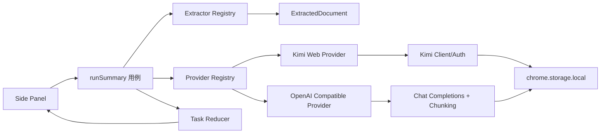

# 架构与数据流

## 组件边界



UI 只订阅任务状态。提取器不知道 Token、Prompt 或会话；Provider 不知道 DOM 和 React；应用编排只依赖 `SummaryProvider`。

## Provider 契约

```ts
interface SummaryProvider {
  id: "kimi-web" | "openai-compatible";
  validateReady(): Promise<void>;
  summarize(request: SummaryRequest, signal: AbortSignal): AsyncIterable<SummaryEvent>;
}
```

`SummaryEvent` 只有四类：阶段、增量文本、warning 和完成。Kimi 完成事件带继续对话 URL；兼容端完成事件不带 URL。

## 任务生命周期

```text
idle
  -> loading(准备中)
  -> loading(extracting)
  -> loading(uploading/chunking/summarizing)
  -> success
  -> error / auth-required / provider-not-configured
```

每次重新总结都会先 abort 旧 `AbortController`，侧边栏卸载也会 abort。取消、后端切换和新任务不会自动切换到另一个 Provider。

## OpenAI Compatible 请求

请求地址固定为 `${apiRoot}/chat/completions`，请求头为 `Authorization: Bearer <token>`（loopback 空 Token 时省略），请求体固定包含 `model`、`stream` 和 system/user messages。

短内容一次请求。长内容先按标题、段落和换行边界分块；局部摘要顺序执行，再按相同上限分组递归归并，最终一轮流式输出。超过 `maxSourceChars` 时保留首尾并产生 warning；单分块上下文超限时递归减半，低于 2000 字符仍失败则终止任务。

## Kimi Web 请求

Kimi 适配层集中处理：refresh token、single-flight 刷新、一次 401 重放、预签名上传、文件注册、解析 SSE、创建 chat 和 completion SSE。文件上传/解析失败且存在 `sourceText` 时只在同一 Provider 内降级，不跨 Provider。

## 存储和权限

- 设置：`chrome.storage.local` 的 `settings:v2`。
- OpenAI Token：独立 key `secrets:openai-compatible:v1`，加载设置页时只显示“已配置”。
- Kimi Token：兼容旧 key `local:kimi_tokens`。
- API Root 保存前校验协议并通过用户手势请求 `${origin}/*` 可选权限；修改 Root 后撤销旧 origin。
- content script 不接触 Token；兼容请求从 sidepanel extension page 发起。

## 失败分类

`AppError` 将认证、权限、提取、上传、解析、上下文超限、限流、服务不可用、协议错误和取消映射为 UI 行为。网络重试只在同一兼容 Provider 内发生；401/403 不重试，也不隐式发送到另一个后端。
