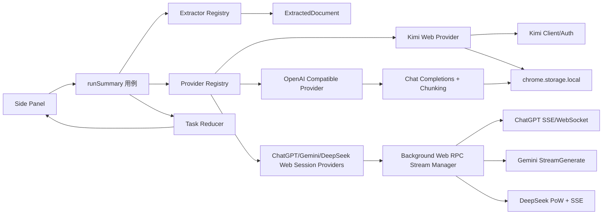

# 架构与数据流

## 组件边界



UI 只订阅任务状态。提取器不知道 Token、Prompt 或会话；Provider 不知道 React；应用编排只依赖 `SummaryProvider`。网页会话适配器只在登录/验证阶段使用目标页面，不从答案 DOM 取结果。

## 提取器注册约束

提取器的 `ExtractorDescriptor.id` 表示站点适配器身份，`outputKind` 表示最终生成的 `ExtractedDocument.kind`。两者必须保持独立：例如 Feedly 的身份是 `feedly`，但输出仍是 `webpage`。

Registry 按明确顺序尝试提取器，专用站点适配器必须排在普通网页兜底之前。`canHandle` 负责便宜的 URL 判断；对 URL 形状通用的站点，registry 还会等待可取消的异步 `probe`，探测当前页面的 DOM 标记和同源 JSON，失败后继续普通网页。新增 URL/DOM 站点时，只需新增带 descriptor 的提取器、在 registry 中添加一条注册项，并补充 URL 路由与提取行为测试；不需要修改 `runSummary` 或 Provider。

### 讨论站点提取

Discourse 适配器支持根路径和子路径安装（例如 `/forum/t/...`），使用当前标签页 MAIN world 的 `credentials: include` 请求，不复制或保存 Cookie。短主题读取全部帖子；超过 50 个帖子时读取 Discourse 的原生 summary，再通过 `/t/{id}/posts.json` 补齐选中的帖子，并为热门且有回复的帖子调用 `/posts/{postId}/replies.json` 展开直接回复。最终按 `post_number` 排序，保留 `reply_to_post_number`，并在 200 个帖子 / 160,000 个讨论字符处停止，输出省略 warning。

知乎适配器严格限定 `zhihu.com` 与 `www.zhihu.com` 的问题/回答路径。问题页默认展开前 5 个完整回答，每个回答读取 5 条顶层评论和每条 3 条回复；回答页读取完整回答、20 条顶层评论和每条 3 条回复。评论分页会校验仍属于当前回答，ID 以字符串处理，分页中断时保留已读取内容。

## Provider 契约

```ts
interface SummaryProvider {
  id: "kimi-web" | "chatgpt-web" | "gemini-web" | "deepseek-web" | "openai-compatible";
  validateReady(): Promise<void>;
  summarize(request: SummaryRequest, signal: AbortSignal): AsyncIterable<SummaryEvent>;
}
```

`SummaryEvent` 有阶段、增量文本、累计快照、warning 和完成五类。Kimi/兼容端继续保留增量事件；ChatGPT、Gemini、DeepSeek 的 Web 协议通常返回累计文本，因此通过 `snapshot` 替换任务中的 Markdown，避免重复拼接。网页会话完成事件带原生站点继续对话 URL。

网页会话 Provider 使用 Kimi 风格的登录采集流程：用户点击登录后，扩展请求目标 origin 的可选 host permission，优先复用已打开的同站点 Tab；没有可复用页面时才创建一个临时登录/验证 Tab，采集成功后关闭扩展创建的 Tab，用户原有 Tab 不关闭。ChatGPT 登录时采集 `/api/auth/session` 的 access token，正常请求在扩展后台调用 `/backend-api/conversation`，兼容普通 SSE 与可靠 WebSocket 流。Gemini 登录时只保存账号索引和登录标记，每次请求后台重新读取 `/app` 中短期 `at/bl/f.sid` 参数，再调用参考 `gemini-nexus` 的 `StreamGenerate`。DeepSeek 登录时采集 `localStorage.userToken`，后台创建会话、计算 PoW、调用 completion SSE。三家都通过 runtime Port 传递累计 Markdown 快照、取消和错误，不自动向网页输入 Prompt；登录/验证 Tab 是授权与 WAF 的兜底，不是答案 DOM 兜底。页面结构或内部协议变化会显示明确的 `auth-required`/`api-unavailable`/`api-contract`，不会静默改用另一家后端。

## 任务生命周期

```text
idle
  -> loading(准备中)
  -> loading(extracting)
  -> loading(uploading/chunking/summarizing)
  -> success
  -> error / auth-required / provider-not-configured
```

每次重新总结都会先 abort 旧 `AbortController`，侧边栏卸载也会 abort。取消、后端切换和新任务不会自动切换到另一个 Provider。

## OpenAI Compatible 请求

请求地址固定为 `${apiRoot}/chat/completions`，请求头为 `Authorization: Bearer <token>`（loopback 空 Token 时省略），请求体固定包含 `model`、`stream` 和 system/user messages。

短内容一次请求。长内容先按标题、段落和换行边界分块；局部摘要顺序执行，再按相同上限分组递归归并，最终一轮流式输出。超过 `maxSourceChars` 时保留首尾并产生 warning；单分块上下文超限时递归减半，低于 2000 字符仍失败则终止任务。

## Kimi Web 请求

Kimi 适配层集中处理：refresh token、single-flight 刷新、一次 401 重放、预签名上传、文件注册、解析 SSE、创建 chat 和 completion SSE。文件上传/解析失败且存在 `sourceText` 时只在同一 Provider 内降级，不跨 Provider。

## 存储和权限

- 设置：`chrome.storage.local` 的 `settings:v2`。
- OpenAI Token：独立 key `secrets:openai-compatible:v1`，加载设置页时只显示“已配置”。
- Kimi Token：兼容旧 key `local:kimi_tokens`。
- ChatGPT Web：`local:web_session_credentials:v1` 只保存登录采集到的 access token 和采集时间；请求时从 Chrome Profile 读取 Cookie/oai-did，仅在本次请求内存中使用，不写入存储或日志，页面正文也不落盘。DeepSeek 同一 key 只保存 `userToken` 和采集时间，后台用它换取的短时 access token 只在内存缓存；不读取或保存 Cookie。Gemini 同一 key 只保存账号索引/登录标记，`at/bl/f.sid` 每次请求刷新后只存在内存中。目标站点的 Cookie 仍由 Chrome Profile 管理。
- Web 会话后台通道：每个 runtime Port 有独立的 `AbortController`、request id 和 10 秒 heartbeat；侧边栏取消、关闭或切换 Provider 时发送 cancel，后台停止 fetch/SSE/WebSocket/PoW 请求。快照在 sidepanel 内以 Markdown 重新渲染，reasoning/thought 字段不映射到 UI。
- 设置页 Web 会话状态：对已打开的对应站点 Tab 重新验证登录态；没有页面但存在本地凭据时显示“已保存、未验证”，不把本地标记直接视为在线。连接测试沿用生产 Web RPC 并发送固定测试 Prompt。
- API Root 保存前校验协议并通过用户手势请求 `${origin}/*` 可选权限；修改 Root 后撤销旧 origin。
- content script 不接触 Token；兼容请求从 sidepanel extension page 发起。
- Bilibili 元数据与字幕请求由 background service worker 发起，固定声明 `api.bilibili.com` 和 `*.hdslb.com` host permissions，使用 `credentials: "include"` 获取站点会话能力；扩展不申请 `cookies` 权限、不读取或持久化 SESSDATA。已签名字幕资源使用 `credentials: "omit"`。
- YouTube 字幕优先从当前标签页 MAIN world 的播放器状态和 Performance timeline 读取；没有字幕轨时回退到页面同源 InnerTube player 请求。字幕请求先复用页面已经带 PO Token 的 timedtext URL，再按 BiliNote/youtube-transcript-api 的去 `fmt` 方式和 yt-dlp 的 JSON3、SRV、TTML、SRT、WebVTT 格式尝试；当前 Web 字幕轨返回空内容时，先读取 YouTube 自己的 transcript 面板，再从页面会话请求 Android VR、iOS、TV、VisionOS 播放器客户端的备用字幕轨。同源请求使用 `credentials: "include"`，跨源签名字幕地址使用 `credentials: "omit"`。主流程不新增固定 YouTube host permission；选项页的提取器测试页仅在用户点击扫描/提取时请求选定目标页面的精确可选权限，不申请或保存站点 Cookie。
- Gemini Web 总结 YouTube 时不经过字幕提取器：总结编排直接构造 YouTube 链接文档，Gemini Web RPC 提交视频 URL 和用户 Prompt，由 Gemini 自身处理视频内容；协议失败显示明确错误，不用页面答案 DOM 代答，其他 Provider 继续使用提取器结果。
- Discourse/知乎同源 API 请求在标签页会话内执行；API 首次失败才退回普通 DOM 正文，后续评论或回复失败只产生 warning，不把不完整内容伪装成完整讨论。

## 失败分类

`AppError` 将认证、权限、提取、上传、解析、上下文超限、限流、服务不可用、协议错误和取消映射为 UI 行为。网络重试只在同一兼容 Provider 内发生；401/403 不重试，也不隐式发送到另一个后端。
